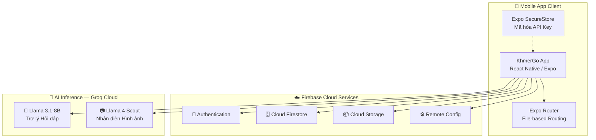
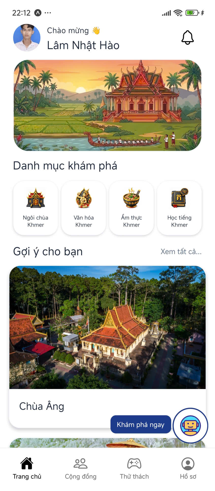
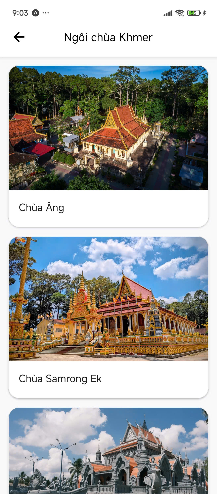
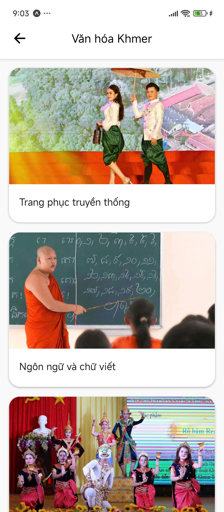
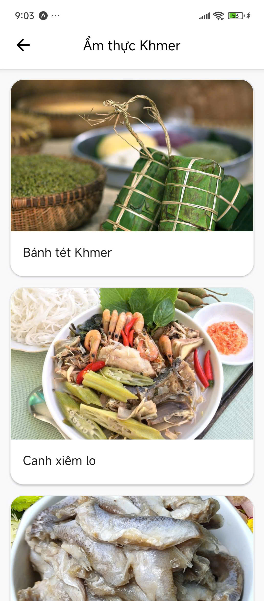
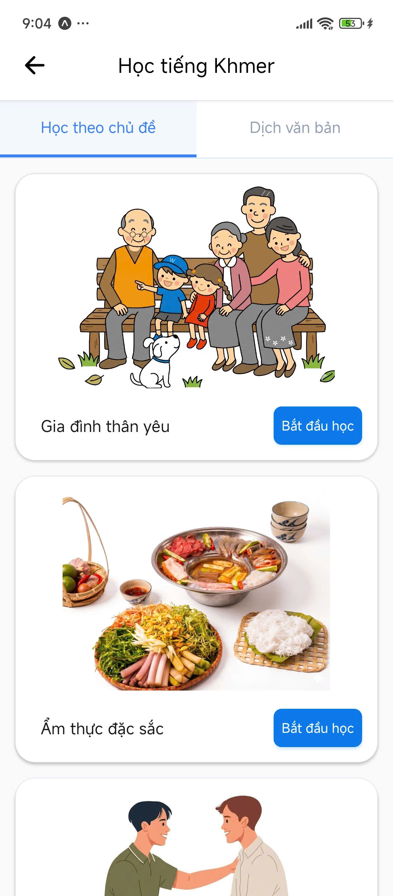
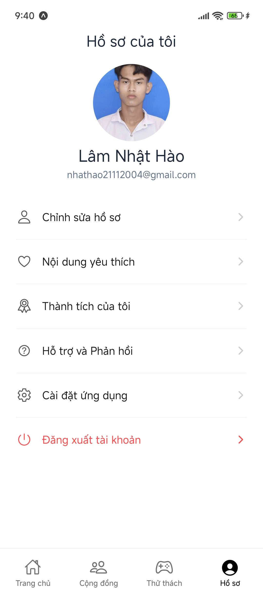
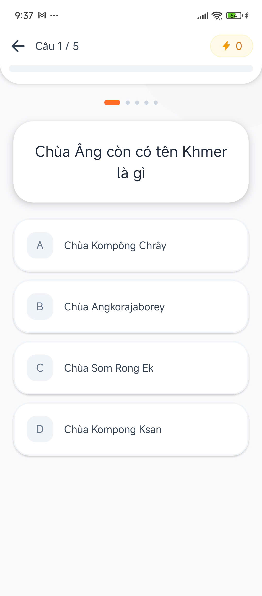
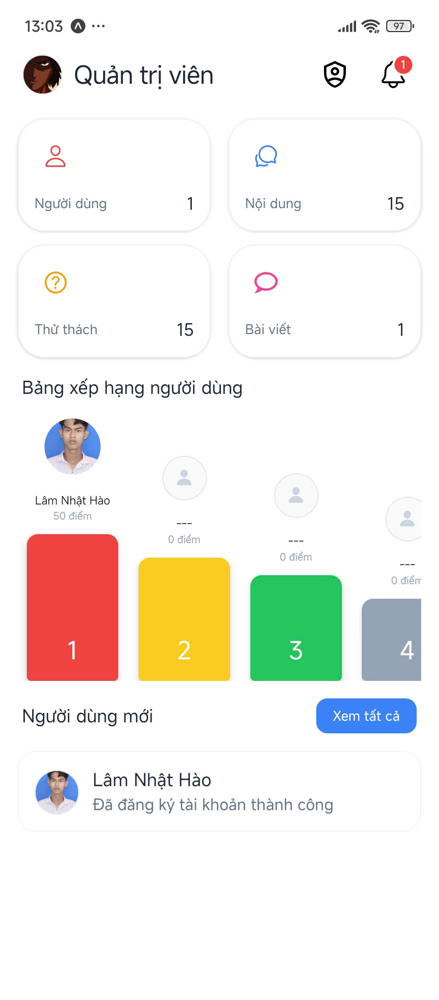

<div align="center">

# KhmerGo

### Ứng dụng Hỗ trợ Du lịch và Tìm hiểu Văn hóa Khmer Nam Bộ

<p>
  
</p>

[](https://reactnative.dev/)
[](https://expo.dev/)
[](https://www.typescriptlang.org/)
[](https://firebase.google.com/)
[](https://groq.com/)
[](./LICENSE)

<br/>

> *"Số hóa di sản — Kết nối văn hóa Khmer Nam Bộ với thế giới hiện đại"*

<br/>

[📱 Demo Video](./videos/KhmerGo.mp4) · [📄 Báo cáo Đồ án](./docs/110122071.pdf) · [🖼️ Poster](./docs/Poster.png) · [📖 Hướng dẫn Sử dụng](./docs/HuongDanSuDung.pdf)

</div>

---

## 📋 Mục lục

- [Giới thiệu](#-giới-thiệu)
- [Tính năng nổi bật](#-tính-năng-nổi-bật)
- [Tech Stack](#-tech-stack)
- [Kiến trúc Hệ thống](#-kiến-trúc-hệ-thống)
- [Cấu trúc Thư mục](#-cấu-trúc-thư-mục)
- [Ảnh chụp Giao diện](#-ảnh-chụp-giao-diện)
- [Cài đặt & Chạy Chương trình](#-cài-đặt--chạy-chương-trình)
- [Triển khai APK](#-triển-khai-apk-eas-build)
- [Thông tin Đồ án](#-thông-tin-đồ-án)

---

## 🌟 Giới thiệu

**KhmerGo** là ứng dụng di động đa nền tảng được phát triển bằng **React Native** & **Expo**, phục vụ khách du lịch trong việc trải nghiệm, khám phá và tìm hiểu các giá trị văn hóa, kiến trúc, ẩm thực truyền thống của đồng bào **Khmer Nam Bộ**.

Dự án tích hợp các công nghệ thông minh tiên tiến:
- 🤖 **AI Vision** — Nhận diện hiện vật văn hóa Khmer qua camera
- 💬 **AI Chatbot** — Trợ lý ảo hỏi đáp văn hóa Khmer thời gian thực
- 🎮 **Gamification** — Hệ thống huy chương, quiz tăng tương tác người dùng

---

## ✨ Tính năng nổi bật

<table>
<tr>
<td width="50%">

### 🏯 Khám phá Di sản
- Danh sách chùa Khmer cổ kính (Trà Vinh, Sóc Trăng, An Giang...)
- Thông tin lịch sử, kiến trúc chi tiết
- Bản đồ tích hợp định vị

</td>
<td width="50%">

### 🍜 Ẩm thực Truyền thống
- Bộ sưu tập món ăn đặc sắc (bún nước lèo, cốm dẹp, mắm bò hóc...)
- Công thức & câu chuyện văn hóa
- Đánh giá & phản hồi cộng đồng

</td>
</tr>
<tr>
<td width="50%">

### 🤖 AI Camera — Nhận diện Hiện vật
- Chụp ảnh nhạc cụ cổ truyền (nhạc ngũ âm, xà-rông...)
- Phân tích bằng **Llama 4 Scout Vision**
- Kết quả tra cứu tức thì

</td>
<td width="50%">

### 💬 Trợ lý ảo KhmerGo AI
- Hỏi đáp lịch sử, nghệ thuật múa Rô-băm, lễ hội...
- Tích hợp **Llama 3.1** qua Groq Cloud
- Phản hồi chính xác theo dữ liệu tuyển chọn

</td>
</tr>
<tr>
<td width="50%">

### 🏅 Gamification & Quiz
- Hệ thống XP, Level, Huy chương (Badges)
- Quiz văn hóa & ẩm thực Khmer
- Bảng xếp hạng người dùng

</td>
<td width="50%">

### 👥 Cộng đồng & Admin
- Đăng bài, chia sẻ trải nghiệm
- Phản hồi & đánh giá địa danh
- Dashboard quản trị viên tích hợp

</td>
</tr>
</table>

---

## 🔧 Tech Stack

<table>
<tr>
<th align="center">Phân tầng</th>
<th align="center">Công nghệ</th>
<th align="center">Vai trò</th>
</tr>
<tr>
<td><strong>📱 Frontend</strong></td>
<td>
  
  
  
</td>
<td>Ứng dụng di động đa nền tảng (Android & iOS)</td>
</tr>
<tr>
<td><strong>🧭 Navigation</strong></td>
<td>
  
</td>
<td>File-based routing, Tab & Stack navigation</td>
</tr>
<tr>
<td><strong>🔐 Auth</strong></td>
<td>
  
</td>
<td>Xác thực đăng nhập / đăng ký người dùng</td>
</tr>
<tr>
<td><strong>🗄️ Database</strong></td>
<td>
  
</td>
<td>Cơ sở dữ liệu NoSQL thời gian thực</td>
</tr>
<tr>
<td><strong>📦 Storage</strong></td>
<td>
  
</td>
<td>Lưu trữ ảnh đại diện, tài liệu đa phương tiện</td>
</tr>
<tr>
<td><strong>🤖 AI Chat</strong></td>
<td>
  
  
</td>
<td>Trợ lý hỏi đáp văn hóa Khmer (NLP)</td>
</tr>
<tr>
<td><strong>📷 AI Vision</strong></td>
<td>
  
  
</td>
<td>Nhận diện hiện vật văn hóa qua hình ảnh</td>
</tr>
<tr>
<td><strong>⚙️ Config</strong></td>
<td>
  
  
</td>
<td>Cấu hình model AI động & bảo mật API Key</td>
</tr>
</table>

---

## 🏗️ Kiến trúc Hệ thống



---

## 📁 Cấu trúc Thư mục

```
tn-da22ttd-lamnhathao-ungdungvanhoakhmer/
│
├── 📂 docs/                          # Tài liệu đồ án
│   ├── 110122071.doc                 #   Báo cáo Word
│   ├── 110122071.pdf                 #   Báo cáo PDF
│   ├── bia.doc                       #   Bìa đồ án
│   ├── HuongDanSuDung.pdf            #   Hướng dẫn sử dụng
│   ├── Poster.png                    #   Poster giới thiệu
│   └── Slide.pptx                    #   Slide thuyết trình
│
├── 📂 images/                        # Hình ảnh minh họa giao diện
│   └── *.jpg                         #   Screenshots ứng dụng
│
├── 📂 src/                           # Mã nguồn chính
│   ├── 📂 database/
│   │   ├── firestore.rules           #   Quy tắc bảo mật Firestore
│   │   └── firestore_export.json     #   Dữ liệu mẫu (seed data)
│   │
│   └── 📂 mobile-app/               #   Ứng dụng React Native
│       ├── 📂 app/                   #     Màn hình (Expo Router)
│       ├── 📂 components/            #     UI Components tái sử dụng
│       ├── 📂 constants/             #     Hằng số & cấu hình
│       ├── 📂 contexts/              #     React Context (Auth, Theme...)
│       ├── 📂 hooks/                 #     Custom Hooks
│       ├── 📂 services/              #     API & Firebase services
│       ├── 📂 utils/                 #     Tiện ích & helper functions
│       ├── 📂 assets/                #     Icon, font, hình ảnh
│       ├── 📂 scripts/               #     Script hỗ trợ (seed, export...)
│       ├── app.json                  #     Cấu hình Expo
│       ├── package.json              #     Dependencies
│       └── .env.example              #     Mẫu biến môi trường
│
├── 📂 videos/                        # Video demo
│   └── KhmerGo.mp4                   #   Video minh họa ứng dụng
│
└── README.md                         # Tài liệu hướng dẫn (file này)
```

---

## 📸 Ảnh chụp Giao diện

<div align="center">

<!-- Row 1 -->
<table>
<tr>
<td align="center"><strong>Trang chủ</strong></td>
<td align="center"><strong>Danh sách Chùa</strong></td>
<td align="center"><strong>Văn hóa lễ hội</strong></td>
<td align="center"><strong>Ẩm thực</strong></td>
<td align="center"><strong>Học tiếng Khmer</strong></td>
</tr>
<tr>
<td></td>
<td></td>
<td></td>
<td></td>
<td></td>
</tr>
</table>

<!-- Row 2 -->
<table>
<tr>
<td align="center"><strong>AI Chatbot</strong></td>
<td align="center"><strong>AI Camera</strong></td>
<td align="center"><strong>Hồ sơ cá nhân</strong></td>
<td align="center"><strong>Thử thách Quiz</strong></td>
<td align="center"><strong>Dashboard quản trị</strong></td>
</tr>
<tr>
<td></td>
<td></td>
<td></td>
<td></td>
<td></td>
</tr>
</table>

</div>

---

## 🚀 Cài đặt & Chạy Chương trình

### Yêu cầu hệ thống

| Phần mềm | Phiên bản | Ghi chú |
|-----------|-----------|---------|
| **Node.js** | `≥ 18.x LTS` | Khuyến nghị `v20.x` |
| **npm** / yarn | `≥ 9.x` | Đi kèm Node.js |
| **Expo Go** | Mới nhất | Cài từ App Store / Play Store |
| **Git** | Mới nhất | Quản lý mã nguồn |
| **Android Studio** | Tùy chọn | Chạy Emulator |

### Bước 1 → Tải mã nguồn

```bash
git clone https://github.com/NhatHao2004/tn-da22ttd-lamnhathao-ungdungvanhoakhmer.git
cd tn-da22ttd-lamnhathao-ungdungvanhoakhmer/src/mobile-app
```

### Bước 2 → Cài đặt Dependencies

```bash
npm install
```

### Bước 3 → Cấu hình biến môi trường

```bash
cp .env.example .env
```

Mở file `.env` và điền các giá trị tương ứng:

```env
# 🤖 Groq AI API Key
EXPO_PUBLIC_GROQ_API_KEY=gsk_xxxxxxxxxxxx

# 🔥 Firebase Configuration
EXPO_PUBLIC_FIREBASE_API_KEY=AIzaSy...
EXPO_PUBLIC_FIREBASE_AUTH_DOMAIN=your-project.firebaseapp.com
EXPO_PUBLIC_FIREBASE_PROJECT_ID=your-project-id
EXPO_PUBLIC_FIREBASE_STORAGE_BUCKET=your-project.appspot.com
EXPO_PUBLIC_FIREBASE_MESSAGING_SENDER_ID=123456789
EXPO_PUBLIC_FIREBASE_APP_ID=1:123456789:web:abcdef
EXPO_PUBLIC_FIREBASE_MEASUREMENT_ID=G-XXXXXXXXXX
```

> [!CAUTION]
> **Không commit file `.env` lên Git!** File này chứa API key nhạy cảm. Nếu build qua EAS, hãy cấu hình secrets tại [expo.dev](https://expo.dev).

### Bước 4 → Khởi chạy ứng dụng

```bash
npx expo start
```

| Phím tắt | Hành động |
|----------|-----------|
| Quét **QR Code** | Chạy trên thiết bị thật (Expo Go) |
| `a` | Mở Android Emulator |
| `i` | Mở iOS Simulator |
| `w` | Mở trình duyệt Web |

---

## 📦 Triển khai APK (EAS Build)

```bash
# Cài đặt EAS CLI
npm install -g eas-cli

# Đăng nhập Expo
eas login

# Build APK (profile preview)
eas build --platform android --profile preview
```

Sau khi build thành công, EAS cung cấp link tải `.apk` trực tiếp về thiết bị Android.

> [!TIP]
> Cấu hình build được quản lý trong file `eas.json`. Sử dụng profile `production` cho bản phát hành chính thức.

---

## 📝 Thông tin Đồ án

<table>
<tr>
<td><strong>📌 Tên đề tài</strong></td>
<td>Phát triển ứng dụng di động hỗ trợ nâng cao kiến thức về văn hoá của người Khmer Nam Bộ</td>
</tr>
<tr>
<td><strong>🎓 Sinh viên thực hiện</strong></td>
<td><strong>Lâm Nhật Hào</strong> - MSSV: 110122071</td>
</tr>
<tr>
<td><strong>🏫 Trường</strong></td>
<td>Đại học Trà Vinh - Khoa Kỹ thuật và Công nghệ</td>
</tr>
<tr>
<td><strong>📚 Ngành</strong></td>
<td>Công nghệ Thông tin - Lớp DA22TTD</td>
</tr>
<tr>
<td><strong>📅 Năm học</strong></td>
<td>2022</td>
</tr>
</table>

---

<div align="center">

**⭐ Nếu dự án hữu ích, hãy cho một Star trên GitHub! ⭐**

**Lâm Nhật Hào**

</div>